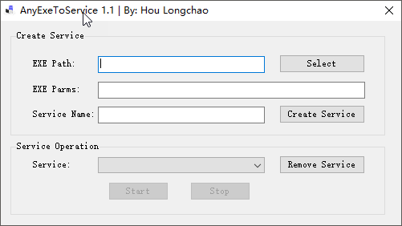

# AnyExeToServer 将任意exe以服务形式运行

使用说明：
1. `EXE Path`中通过`Select`按钮选择想要以服务形式运行的exe程序
2. `EXE Parms`中填入上面选中exe启动时需要传入的参数
3. `Service Name`填入服务的名字，该名字将在下面的服务列表中显示
4. 点击`Create Service`将会创建一个服务
5. 在`Service Operation`栏目中从`Service`中选中刚才创建的服务
6. 然后针对该服务进行`Start`/`Stop`/`Remove` 等操作

软件截图：